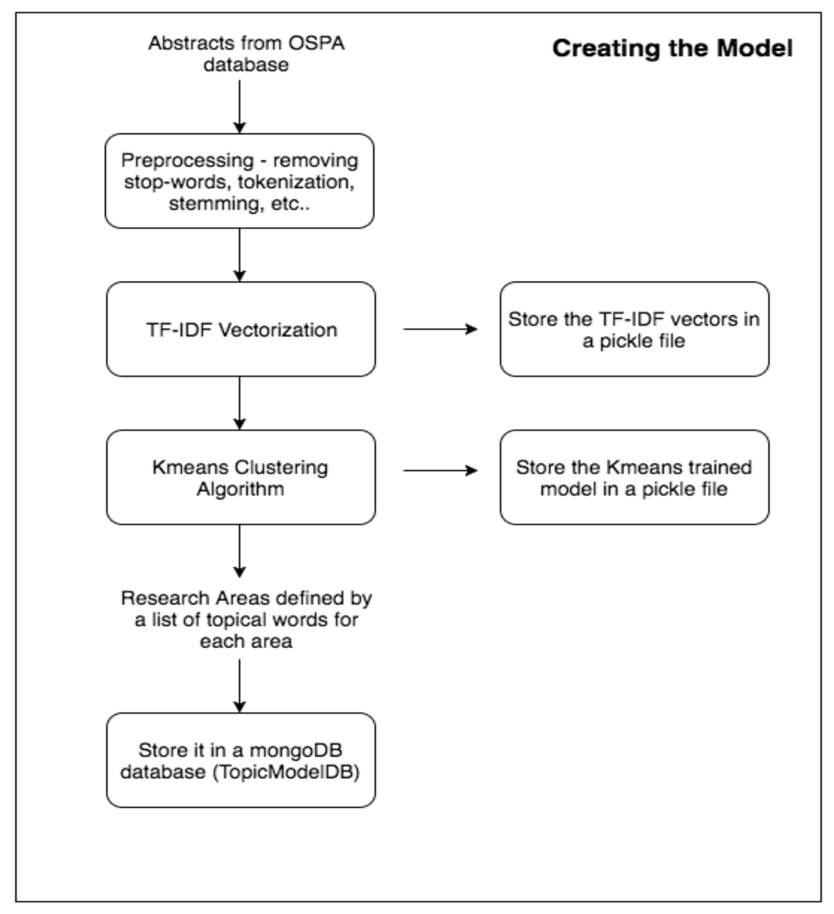
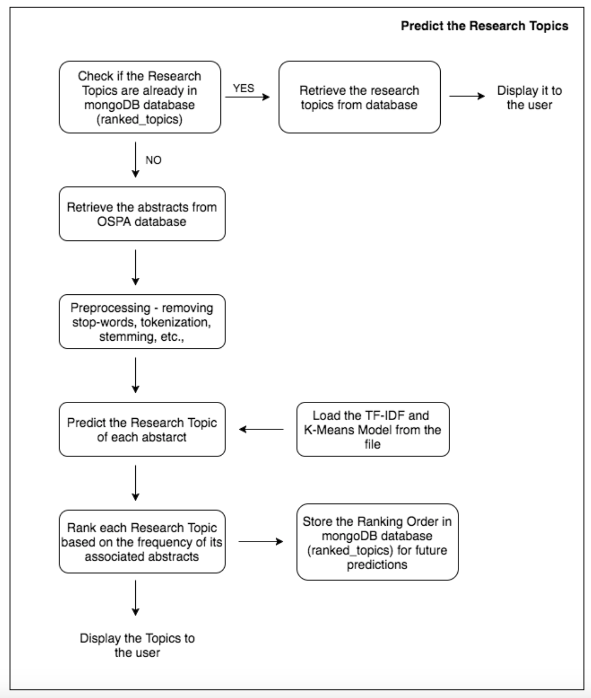

# Ranking research areas based on grant proposals

This project aims to build a tool that identifies the research areas and ranks them based on their popularity among the university's research community. It uses various sections of the grant proposal (like abstracts, title, topical areas, keywords) submitted by the researchers, to build an unsupervised learning model that learns the features present in the text and classifies the proposals into various research categories. These categories are ranked based on the number of proposals related to a particular category.

## System Architecture:

The system consists of 2 parts: create model and predict research topics

1. **Create Model**

<p align="center">
  
</p>

2. **Predict Research Topics**

<p align="center">
  
</p>

## Basic Commands

- To generate a list of research areas sorted by their popularity among a given research community 
    ```
    python topic_modeling.py <start_year> <end_year> <number_of_topics> <num_of_words_per_topic> <hostname> <user> <password> <database_name> <create_model_Flag> <num_of_clusters>
    ```
  **Arguments**
  * _start_year_, _end_year_: The period for which the research activity is to monitored.
  * _number_of_topics_: Specifies the top n research areas/topics to be displayed in the output.
  * _number_of_words_per_topic_: Specifies the number of keywords to describe a particular topic.
  * _hostname_: The hostname of the database containing grant proposals.
  * _user_: The username of the database.
  * _password_: The password of the database.
  * _database_name_: The name of the database containing the grant proposals.
  * _create_model_Flag(optional)_: It takes binary value 0 or 1. A value of 0 creates the unsupervised model from the data. 
                                 A value of 1 uses the existing model to predict and rank the research topics. It defaults to 0.
  * _num_of_clusters(optional)_: Specifies the upper limit on the number of research categories that exists in a particular research environment. It defaults to 75.

**NOTE**: This system requires certain python packages which are specified in the `requirements.txt` file. These dependencies
must be installed as a part of setting up the development environment.
